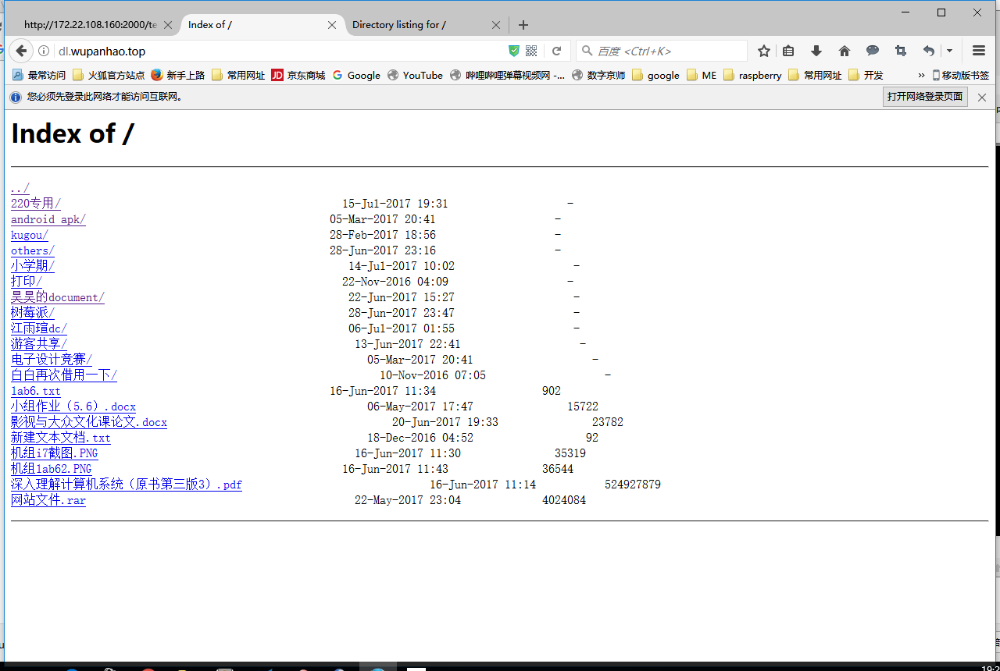
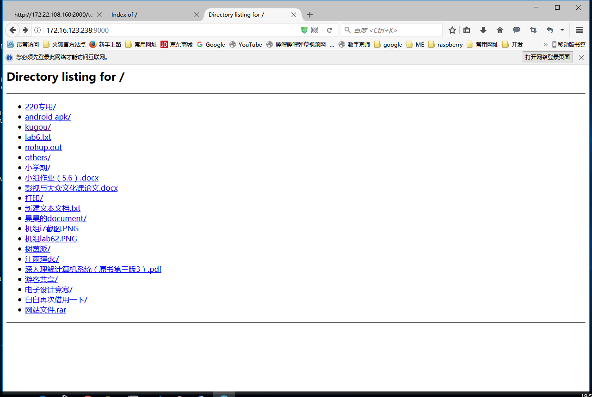

# 3.1 网页服务器

## nginx服务器

### 安装

`sudo apt-get install nginx`

### 添加php支持

先安装必要的软件包，通常选择php-fpm
`sudo apt-get install php-fpm`

修改配置文件
/etc/nginx/sites-enabled/default

找到如下配置段
```
    location ~ \.php$ {
    #   include snippets/fastcgi-php.conf;
    #
    #   # With php7.0-cgi alone:
    #   fastcgi_pass 127.0.0.1:9000;
    #   # With php7.0-fpm:
    #   fastcgi_pass unix:/run/php/php7.0-fpm.sock;
    }
```

配置文件里也说明了，将如下两行取消注释即可
```
#   include snippets/fastcgi-php.conf;
#   fastcgi_pass unix:/run/php/php7.0-fpm.sock;
```

记得重启nginx

nginx默认网站根目录在/var/www/html，可以新建一份php脚本来测试是否配置成功,如将`<?php phpinfo();?>`保存为index.php，然后`curl localhost/index.php`或浏览器访问对应的url查看输出信息

### laravel支持

添加如下配置文件即可
```
server {
       listen 8888 ;
       #listen [::]:80;

       server_name lara.wupanhao.top;

       root /root/laravel/public;
       index index.php index.html;

       location / {
               try_files $uri $uri/ /index.php?$query_string;
       }

    location ~ \.php$ {
        include snippets/fastcgi-php.conf;
    #
    #   # With php7.0-cgi alone:
    #   fastcgi_pass 127.0.0.1:9000;
    #   # With php7.0-fpm:
        fastcgi_pass unix:/run/php/php7.0-fpm.sock;
    }
}
```

重点是location里那句重写url的规则

### web静态文件服务器
局域网内经常需要用到文件共享，ftp、samba等文件服务器固然十分强大，但有时只是想简单分享一些东西，网页版的可能更方便，下面介绍两种感觉比较简单的搭建静态文件服务器的方法，速度方面单用户使用的时候就和师大云盘差不多，已经是校园网带宽的极限

### nginx 配置为静态文件服务器
添加如下配置段后重启即可
```
server {
        client_max_body_size 4G;
    charset utf-8; ##防止中文乱码
        listen  80;  ## listen for ipv4; this line is default and implied
        server_name dl.wupanhao.top; ##域名或ip地址
    root /media/pi/Linux/Public; ##改为自己打算共享的文件目录
    location / {
         autoindex on; ## 显示索引
             autoindex_exact_size on; ## 显示大小
         autoindex_localtime on;  ## 显示时间
        }
}
```
默认是开放访问，若想添加用户身份验证，可在location块中添加
```
auth_basic   "Restricted";  
auth_basic_user_file /etc/nginx/pass_file;
```
并通过`htpasswd -c -d /etc/nginx/pass_file username`增加用户
每次修改配置文件记得重启`sudo service nginx restart`
效果如图


### python 静态文件服务器
安装好python后其实就已经自带了一个单线程的静态文件服务器类了
可通过运行`python -m SimpleHTTPServer  9000 `启动，不过默认只是单线程，不支持多个用户同时访问，因此有人简单修改变成了一个支持多线程的静态文件服务器
```
import socket
import SocketServer
import BaseHTTPServer
from SimpleHTTPServer import SimpleHTTPRequestHandler

class ForkingHTTPServer(SocketServer.ForkingTCPServer):

   allow_reuse_address = 1

   def server_bind(self):
       """Override server_bind to store the server name."""
       SocketServer.TCPServer.server_bind(self)
       host, port = self.socket.getsockname()[:2]
       self.server_name = socket.getfqdn(host)
       self.server_port = port

def test(HandlerClass=SimpleHTTPRequestHandler,
        ServerClass=ForkingHTTPServer):
   BaseHTTPServer.test(HandlerClass, ServerClass)


if __name__ == '__main__':
   test()
```


在欲共享的目录下运行该脚本即可

也可将上述代码保存为文件ForkStaticServer.py, 放到Python标准库的目录下(在我的电脑上是/usr/lib/python2.7/ForkStaticServer.py), 以后用下面的命令代替之前的命令, 这样搭建出来的静态文件服务器就是支持并发的! 

`python -m ForkStaticServer 9000`

效果如图



